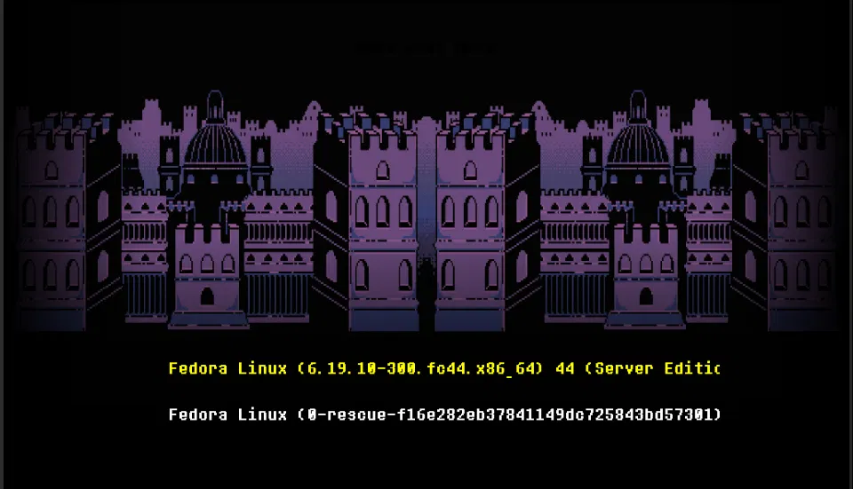

# Grubtale

An Undertale-inspired GRUB2 boot theme — pixel-art castle background, retro bitmap font, and a clean yellow-highlight menu selection.



## Requirements

- GRUB2 (tested on Fedora 44, `grub2-mkconfig`-based systems)
- A display/GRUB graphics mode of **1024x768**

This theme is built and tested for **1024x768 only**. GRUB stretches background and pixmap assets to fill whatever resolution it renders at, with no aspect-ratio-preserving scaling — so using it at a different resolution may distort the artwork. If you want to adapt it for another resolution, you'll need to re-export `background.png` at that resolution and re-test.

## Files

```
grubtale/
├── background.jpg     # fallback/preview background
├── background.png     # actual rendered background
├── font.pf2           # bitmap font used for menu items
├── select.png          # (unused — see Known Issues)
├── theme.txt           # theme definition
└── README.md
```

## Installation (Fedora / RHEL-family)

1. **Copy the theme folder to GRUB's themes directory:**
   ```bash
   sudo cp -r grubtale /boot/grub2/themes/
   ```

2. **Pin your GRUB resolution to 1024x768** — edit `/etc/default/grub`:
   ```
   GRUB_GFXMODE="1024x768"
   GRUB_TERMINAL_OUTPUT="gfxterm"
   GRUB_THEME="/boot/grub2/themes/grubtale/theme.txt"
   GRUB_PRELOAD_MODULES="all_video gfxterm font png jpeg"
   ```
   Do **not** append `,auto` to `GRUB_GFXMODE` — this theme is not resolution-independent, and falling back to an untested resolution may look broken.

3. **Regenerate your GRUB config:**
   ```bash
   sudo grub2-mkconfig -o /boot/grub2/grub.cfg
   ```
   (On UEFI systems, the path may instead be `/boot/efi/EFI/fedora/grub.cfg` — check which `grub.cfg` your system actually boots from.)

4. **Reboot** to see it in effect.

## Installation (Debian/Ubuntu-family, untested)

Paths differ slightly — theme goes in `/boot/grub/themes/`, and config regenerates via:
```bash
sudo update-grub
```
Everything else should be the same. PRs welcome if you test this and it needs adjustment.

## Issues

- Long distro/kernel version strings may get clipped at the right edge of the menu box depending on your entries — adjust `width` in the `boot_menu` block in `theme.txt` if this happens to you.

## Customizing

Key knobs in `theme.txt`:
- `boot_menu { left / top / width / height }` — position and size of the menu box
- `item_font` / `selected_item_color` — text styling
- `item_height` / `item_spacing` — vertical rhythm of menu entries

Reference: [GRUB theme file format](https://www.gnu.org/software/grub/manual/grub/html_node/Theme-file-format.html)
